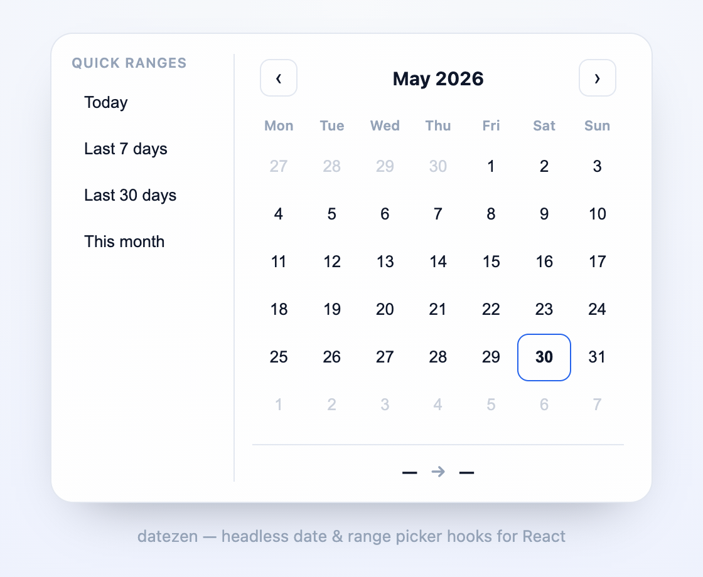

<div align="center">

# 🗓️ datezen

### Headless date & range picker hooks for React.

**Zero styles. Zero dependencies. Fully accessible. ~2.3 KB.**

[](https://www.npmjs.com/package/datezen)
[](https://bundlephobia.com/package/datezen)
[](https://www.npmjs.com/package/datezen)
[](./LICENSE)

<br />



</div>

---

## Why datezen?

Most date pickers either render their own markup — so you fight their DOM to restyle them — or pull in a full design system plus a separate date library. datezen takes the headless approach: it hands you selection state and accessible prop-getters, and **you render every pixel** with any styling solution and no extra dependencies.

```tsx
const { month, getGridProps, getDayProps } = useDatePicker();
// ...spread the props onto your own elements. That's it.
```

## Features

- 🎨 **Truly headless** — the hooks render **no DOM**. Use Tailwind, CSS Modules, styled-components, anything.
- ♿ **Accessible by default** — WAI-ARIA `grid` pattern, full keyboard nav, roving tabindex, screen-reader labels — all wired through prop-getters.
- 📅 **Single _and_ range** — `useDatePicker` and `useDateRangePicker` share one tiny, consistent API.
- ⚡ **Range presets** — "Today", "Last 7 days", "This month"… built in, or define your own.
- 👻 **Live range preview** — follows the mouse _and_ the keyboard while picking the second date.
- 🌍 **i18n via native `Intl`** — localized month/weekday/day labels, configurable week start. No date library.
- 🪶 **~2.3 KB gzipped**, zero dependencies, ESM + CJS, first-class TypeScript types.

## Install

```bash
npm i datezen
```

> `react >= 16.8` is a peer dependency (hooks).

## Quick start — single date

```tsx
import { useDatePicker } from "datezen";

export function DatePicker() {
  const { month, getGridProps, getDayProps, prevButtonProps, nextButtonProps } =
    useDatePicker({ onChange: (d) => console.log(d) });

  return (
    <div className="cal">
      <header className="cal__head">
        <button {...prevButtonProps}>‹</button>
        <strong>{month.label}</strong>
        <button {...nextButtonProps}>›</button>
      </header>

      <div {...getGridProps()} className="cal__grid">
        <div role="row" className="cal__row">
          {month.weekdays.map((wd) => (
            <span role="columnheader" key={wd} className="cal__wd">{wd}</span>
          ))}
        </div>

        {month.weeks.map((week, i) => (
          <div role="row" className="cal__row" key={i}>
            {week.map((day) => (
              <button
                key={day.key}
                {...getDayProps(day)}
                data-selected={day.isSelected || undefined}
                data-today={day.isToday || undefined}
                data-outside={!day.isCurrentMonth || undefined}
                className="cal__day"
              >
                {day.label}
              </button>
            ))}
          </div>
        ))}
      </div>
    </div>
  );
}
```

You write plain buttons; datezen makes them keyboard- and screen-reader-accessible automatically.

## Range picker — with presets & live preview

```tsx
import { useDateRangePicker } from "datezen";

export function RangePicker() {
  const {
    range, presets, applyPreset,
    month, getGridProps, getDayProps, prevButtonProps, nextButtonProps,
  } = useDateRangePicker({
    presets: ["today", "last7", "last30", "thisMonth"],
    onChange: ({ start, end }) => console.log(start, end),
  });

  return (
    <div className="cal">
      <aside className="cal__presets">
        {presets.map((p) => (
          <button key={p.key} onClick={() => applyPreset(p.key)}>{p.label}</button>
        ))}
      </aside>

      <header className="cal__head">
        <button {...prevButtonProps}>‹</button>
        <strong>{month.label}</strong>
        <button {...nextButtonProps}>›</button>
      </header>

      <div {...getGridProps()} className="cal__grid">
        {month.weeks.map((week, i) => (
          <div role="row" className="cal__row" key={i}>
            {week.map((day) => (
              <button
                key={day.key}
                {...getDayProps(day)}
                data-in-range={day.isInRange || undefined}
                data-range-start={day.isRangeStart || undefined}
                data-range-end={day.isRangeEnd || undefined}
                className="cal__day"
              >
                {day.label}
              </button>
            ))}
          </div>
        ))}
      </div>
    </div>
  );
}
```

### Custom presets

```tsx
useDateRangePicker({
  presets: [
    "last7",
    { key: "q1", label: "Q1", getValue: () => ({
      start: new Date(2026, 0, 1),
      end: new Date(2026, 2, 31),
    }) },
  ],
});
```

## Styling (it's all yours)

datezen never sets a class or style. Drive your CSS off the `DayCell` flags via `data-*` attributes:

```css
.cal__day[data-selected]   { background: #2563eb; color: #fff; }
.cal__day[data-in-range]   { background: #dbeafe; }
.cal__day[data-today]      { font-weight: 700; }
.cal__day[data-outside]    { opacity: .35; }
.cal__day:disabled         { opacity: .3; cursor: not-allowed; }
.cal__day:focus-visible    { outline: 2px solid #2563eb; }
```

Works seamlessly as the logic layer under a shadcn/ui-style component — keep your design, drop the boilerplate.

## API

### `useDatePicker(options?)` / `useDateRangePicker(options?)`

| Option | Type | Default | Notes |
| --- | --- | --- | --- |
| `value` | `Date \| null` / `DateRange` | — | Controlled value (omit for uncontrolled). |
| `defaultValue` | `Date \| null` / `DateRange` | `null` / empty | Initial uncontrolled value. |
| `onChange` | `(value) => void` | — | Fires on selection. |
| `min` / `max` | `Date` | — | Inclusive selectable bounds. |
| `locale` | `string` | runtime | BCP-47, e.g. `"fr-FR"`. |
| `weekStartsOn` | `0–6` | `0` (Sun) | First column of the grid. |
| `presets` | `(string \| RangePreset)[]` | common 4 | **range only** — built-in keys or custom. |

**Returns** (shared):

| Field | Description |
| --- | --- |
| `month` | `{ label, date, weekdays, weeks }` — `weeks` is a stable 6×7 `DayCell[][]`. |
| `getGridProps()` | Spread on the grid container (`role="grid"` + keyboard handler). |
| `getDayProps(day)` | Spread on each day `<button>` (ARIA, tabindex, focus ref, click). |
| `prevButtonProps` / `nextButtonProps` | Spread on month-nav buttons. |
| `goToPrevMonth` / `goToNextMonth` | Imperative month navigation. |
| `value` / `range` | Current selection. |
| `setValue` / `setRange` | Imperative setters. |
| `presets` / `applyPreset(key)` | **range only** — resolved presets and a setter. |

**`DayCell`** flags: `date`, `label`, `key`, `isCurrentMonth`, `isToday`, `isSelected`, `isRangeStart`, `isRangeEnd`, `isInRange`, `isDisabled`, `isFocused`.

Built-in preset keys: `today`, `last7`, `last30`, `thisWeek`, `thisMonth`, `thisYear` (also exported as `builtinPresets`).

## Accessibility

Spreading the prop-getters gives you, for free:

- `role="grid"` with `role="row"` / `role="gridcell"` semantics
- **Arrow keys** to move by day, **PageUp/PageDown** by month, **Home/End** to week edges
- **Enter / Space** to select; roving `tabIndex` so the grid is a single tab stop
- Localized `aria-label` per day, `aria-selected`, `aria-current="date"` for today, `aria-disabled` for bounds
- Automatic focus management as the user navigates

## Comparison

| | datezen | react-day-picker | React Aria |
| --- | :---: | :---: | :---: |
| Truly headless (no DOM) | ✅ | ❌ | ✅ |
| Zero dependencies | ✅ | ❌ | ❌ |
| Range + presets built in | ✅ | partial | partial |
| Bundle (gzip) | ~2.3 KB | ~12 KB+ | ~50 KB+ |

## Roadmap

- [ ] Multi-month / dual-calendar range view
- [ ] Time-of-day selection
- [ ] `Temporal` adapter
- [ ] Copy-paste shadcn/ui recipe in docs

## License

[MIT](./LICENSE)
